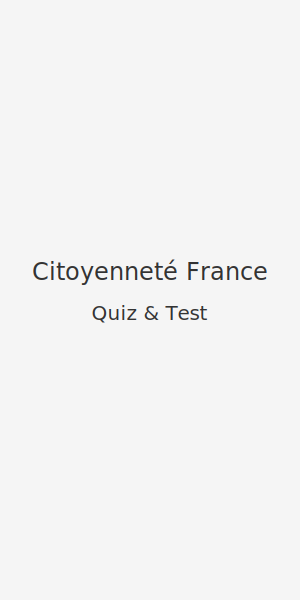

# French Citizenship App

Official name: **Citoyenneté France — Quiz & Test**

## Build & Run

1. Install the [Flutter SDK](https://docs.flutter.dev/get-started/install).
2. Fetch dependencies:
   ```bash
   flutter pub get
   ```
3. Launch the application on a connected device or emulator:
   ```bash
   flutter run
   ```

## Screenshots



## Contributing

Contributions are welcome!

1. Fork this repository and create a feature branch.
2. Make your changes and ensure the project builds:
   ```bash
   flutter analyze
   ```
3. Submit a pull request with a clear description of your changes.

